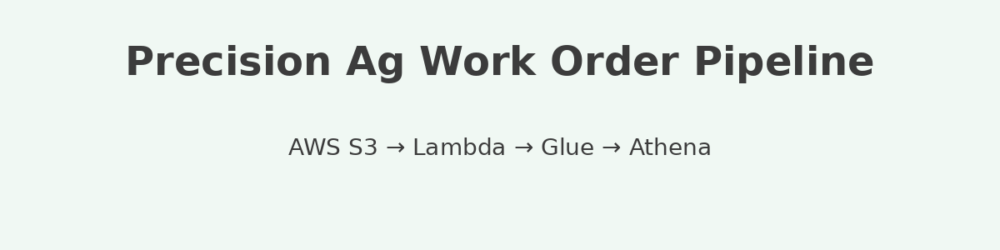

<p align="center">
  
</p>

# precision-ag-work-order-report-s3-lambda-glue-pipeline

An AWS pipeline to process precision agriculture work order reports for BI dashboards using automated serverless functions.

This repository contains a simple, modular AWS pipeline that ingests `.xlsx` work order reports uploaded to S3, triggers a Lambda function, and launches an AWS Glue Crawler to update the data catalog for querying in Athena.

Originally developed for agricultural operations, this pipeline is adaptable to any domain that processes tabular field reports into queryable datasets.

---

## Stack:
- AWS S3 (trigger on upload)
- AWS Lambda (Python)
- AWS Glue Crawler (schema discovery)
- AWS Athena (auto-refreshes table for BI queries)

This project demonstrates a practical AWS serverless architecture using S3, Lambda, Glue, and Athena.  
It is not affiliated with Amazon Web Services or any other company.

See the `permissions/` folder for example IAM and S3 policies used to enable this pipeline. All resource ARNs should be customized for your AWS environment.

---

## Lambda Function: S3 Trigger → Glue Job

The `lambda_function.py` script is the serverless function triggered automatically when a new `.xlsx` file is uploaded to the designated S3 bucket.

### Purpose:
This function extracts the uploaded file's S3 path and initiates a predefined AWS Glue job, passing the S3 file path as a runtime argument. It enables automated ingestion and processing of agricultural work order reports—or any tabular data—into a structured data catalog for querying via Athena or downstream BI tools.

### Features:
- Parses the bucket name and object key from the S3 event
- Filters to only process `.xlsx` files (ignores others)
- Dynamically starts a Glue job using the `boto3` client
- Uses an environment variable `GLUE_JOB_NAME` for flexibility
- Includes logging and basic error handling

### Usage Notes:
- Make sure the Lambda execution role has permissions to:
  - Read from the target S3 bucket
  - Start the specified Glue job
  - Write logs to CloudWatch
- Set the `GLUE_JOB_NAME` environment variable in the Lambda console
- Customize the argument key (`--INPUT_FILE`) if your Glue job uses a different name

See [`lambda_function.py`](lambda_function.py) for the full implementation.

---

## Sample Event: S3 Trigger Format

The file `event_sample.json` contains a sample payload representing what AWS Lambda receives when an `.xlsx` file is uploaded to the configured S3 bucket.

This is useful for:
- Testing the Lambda function locally
- Understanding how the event data is structured
- Debugging or extending the pipeline

### Key Fields:
- `"bucket.name"` – The name of the S3 bucket
- `"object.key"` – The path/key of the uploaded file in the bucket

You can update these fields with your own values for testing.

> **Note:** This sample assumes an `ObjectCreated:Put` event from S3 and reflects the default schema for S3 event notifications.

---

## Glue Job Script: work_order_etl.py

This script is triggered by the Lambda function and runs as part of the Glue job. It:
- Downloads the Excel file from S3
- Cleans and processes the data
- Uploads a normalized `.csv` to S3 for Athena and BI usage

This script is generalized and includes placeholders for logic like:
- Product mapping
- Customer parsing
- Location/region mapping

See [`glue_processing/work_order_etl.py`](glue_processing/work_order_etl.py) for full details.

---

## Configuration

Environment-specific settings (like S3 bucket names) are defined in `glue_processing/config.py`. Values are read from environment variables with sensible defaults.

You can set these variables in a `.env` file or directly in your Lambda/Glue environment.

Example:
```env
INPUT_BUCKET=your-input-bucket
OUTPUT_BUCKET=your-output-bucket
PRODUCT_DICT_BUCKET=your-product-lookup-bucket
PRODUCT_DICT_KEY=product_lookup.csv
```

---

## Installation

To run the ETL script locally for testing:

```bash
pip install -r requirements.txt
python glue_processing/work_order_etl.py --INPUT_FILE s3://your-input-bucket/sample_file.xlsx
```

---

## Glue Crawler

See [`glue_crawler_config.md`](glue_crawler_config.md) for guidance on setting up your crawler, including schema detection and data catalog integration.

---

## IAM & Permissions

All sample IAM and S3 policies can be found in the `permissions/` directory. These should be adjusted to match your own AWS environment and follow the principle of least privilege.
